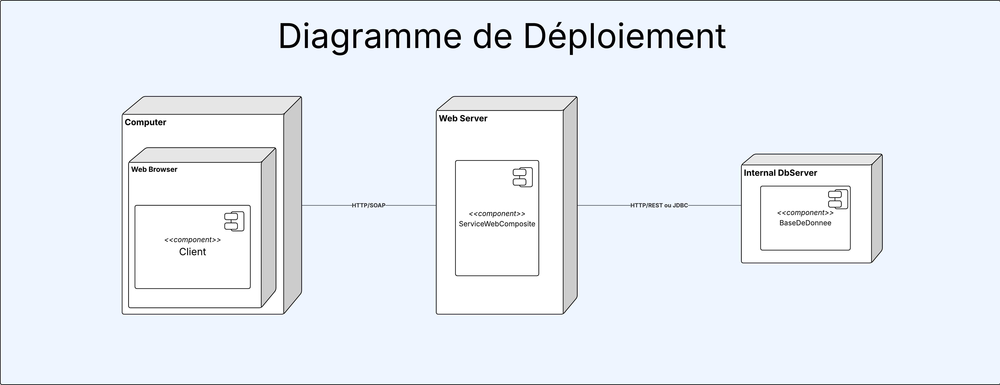
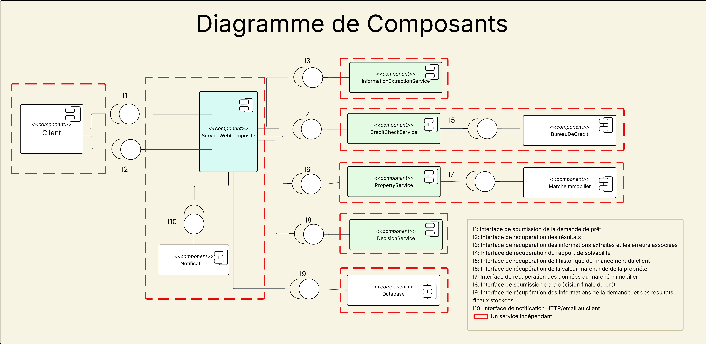

# SOA-SOAP-LoanEvaluation
This project implements a monolithic Service-Oriented Architecture (SOA) for automated loan evaluation.
Unlike a fully distributed SOA, this version integrates all internal services (Information Extraction, Credit Check, Property Evaluation, and Decision) as function calls inside a single composite service.

The only SOAP communication occurs between the composite service and clients — all sub-services run as local Python modules.

## ⚙️ Architecture Overview




🧠 Each client request follows this internal workflow:

When a client sends a loan request (plain text) as a SOAP message using the `SubmitLoanRequest` operation of the **WebCompositeService**, the following steps occur internally:

1. **Information Extraction** – Parses and structures the raw text into key fields (e.g., client name, income, loan amount, property description).

2. **Credit Check** – Simulates a credit bureau analysis to generate a credit score and financial stability assessment.

3. **Property Evaluation** – Estimates the property's market value and evaluates its associated risk factors.

4. **Decision** – Aggregates all previous results to determine whether the loan is approved or rejected, along with detailed reasoning and recommendations.

5. **Database Storage** – The system stores the complete request details, intermediate results, and the final decision in the local database for tracking and audit purposes.

6. **Notification** – A notification message (simulated email/SMS) is logged to indicate the final decision status (Approved/Rejected).

Later, the same `request_id` returned from `SubmitLoanRequest` is used by the client to retrieve the final decision using the `GetEvaluation` operation of the **WebCompositeService**.  The results are then returned to the client as another SOAP message.


## 🧰 Key Features

- ✅ Monolithic but modular architecture
- ✅ SOAP-compliant interface for external clients
- ✅ Synchronous, fast, and lightweight
- ✅ Built-in logging and request tracking
- ✅ Extensible for future distributed or async versions

## 🧩 How to run

### Clone & Setup Environment
```bash
$ git clone https://github.com/LyCrash/SOA-SOAP-LoanEvaluation.git
$ cd SOA-SOAP-LoanEvaluation
$ python -m venv venv
$ .\venv\Scripts\activate   # or source venv/bin/activate on Linux
$ pip install -r src\requirements.txt
```
### Start all services
```bash
$ python main.py
```

## 🧪 Testing

You can test:

- Using the provided Python client (client/client_test.py).
- Or with SOAPUI by importing the WSDL served by the main composite service:
*http://127.0.0.1:8000/LoanEvaluationService?wsdl*